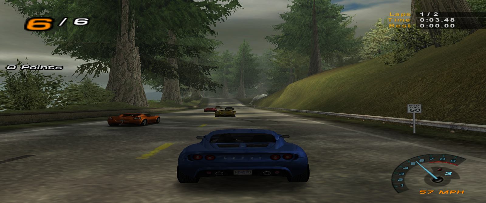

# OpenForSpeed

Classic Need for Speed games running on Linux, with the widescreen fixes and graphics mods already in place.

These games came out between 1998 and 2008. None of them are sold anymore. The community keeps them alive with repacks and mods, and they run really well on Linux once you know the two or three settings that matter. This repo is those settings plus a script that does the boring parts.



## What works

| Game | Year | Status | Notes |
|---|---|---|---|
| Need for Speed Underground | 2003 | plays | widescreen fix, extra options |
| Need for Speed Underground 2 | 2004 | plays | widescreen fix, extra options |
| Need for Speed Most Wanted | 2005 | plays | widescreen, HD reflections, HUD adapter, DSOAL audio |
| Need for Speed Carbon | 2006 | plays | widescreen, HD reflections, HUD adapter, EA Trax in races |
| Need for Speed ProStreet | 2007 | plays | use the ElAmigos repack, not the MagiPack one |
| Need for Speed Undercover | 2008 | plays | set the window mode to 4, then pick your resolution in game |
| Need for Speed III Hot Pursuit | 1998 | plays | keyboard only, the gamepad needs a mapper |
| Need for Speed Hot Pursuit 2 | 2002 | plays | force the builtin d3d8, see below |

Plays means somebody actually drove a race with a controller. Runs means it boots and renders but has not had a full session yet. If you get further with any of them, or get ProStreet going, open an issue and say how.

Tested on this machine:

| | |
|---|---|
| OS | Zorin OS 18.1 (Ubuntu 24.04 base) |
| Kernel | 7.0.0-28-generic |
| Desktop | GNOME on X11, triple monitor |
| CPU | AMD Ryzen 9 3900X, 24 threads |
| RAM | 62 GB |
| GPU | NVIDIA RTX 4070 Ti, driver 580.173.02 |
| Vulkan | 1.4.312 |
| Proton | GE-Proton11-3 |
| Controller | Xbox controller over USB |

Everything installs inside your home folder. No sudo, so this also works on Bazzite, SteamOS and other immutable systems.

## Getting the games

All of these came from [myabandonware](https://www.myabandonware.com/search/q/need+for+speed/pla/4). Search for the game, open its page and grab the exact file listed below. The script finds each game by its file name, so download them and leave the names alone.

| Game | File |
|---|---|
| Underground | `Need-for-Speed-Underground_Win_EN_MagiPack.zip` |
| Underground 2 | `Need-for-Speed-Underground-2_Win_EN_MagiPack.zip` |
| Most Wanted | `Need-for-Speed-Most-Wanted_Win_EN_MagiPack.zip` |
| Carbon | `Need-for-Speed-Carbon_Win_EN_MagiPack.zip` |
| ProStreet | `Need-for-Speed-ProStreet_Win_EN-FR-DE-IT-ES-NL-DA-FI-SV-HU-CS-PL-RU_Repack.zip` |
| Undercover | `Need-for-Speed-Undercover_Win_EN-FR-DE-IT-ES-NL-SV-DA-FI-PL-RU-CS-HU_Repack.zip` |
| NFS III Hot Pursuit | `Need-for-Speed-III-Hot-Pursuit_Win_EN-FR-ES-DE-IT_Modern-Bundle.zip` |
| Hot Pursuit 2 | `Need-for-Speed-Hot-Pursuit-2_Win_EN_LGU-Repack-by-Bladez1992.zip` |

These are the exact versions everything here was tested against. Other releases of the same game may work, but these are the ones I know work.

### ProStreet is the odd one out

Do not use `Need-for-Speed-ProStreet_Win_EN_MagiPack.zip`. I tried it first because the MagiPack builds are the best choice for every other game, and it crashes on startup every single time with the same page fault. Details are further down.

The ElAmigos repack in the table above starts with no fuss. It ships the plain game with no mods, and the script downloads the widescreen fix for it during install.

### Downloading

These files are large and the hosts have wait timers. [JDownloader](https://jdownloader.org/) queues them up and deals with the timers while you do something else:

```bash
flatpak install flathub org.jdownloader.JDownloader
```

Put everything in one folder. The script searches recursively, so subfolders are fine.

## Install

```bash
git clone https://github.com/agentkyo/openforspeed.git
cd openforspeed
./install.sh --list
./install.sh --source ~/Downloads --game most-wanted
```

Install several at once:

```bash
./install.sh --source ~/Downloads --game underground --game underground-2 --game most-wanted
```

Or everything it can find:

```bash
./install.sh --source ~/Downloads --all
```

Check your system without installing anything:

```bash
./install.sh --check --source ~/Downloads --all
```

```
==> Checking your system
  distro : Zorin OS 18.1
  kernel : 7.0.0-28-generic
  session: x11

  [ ok ] running as user, no root needed
  [ ok ] curl, tar, unzip, 7z and python3 are available
  [ ok ] GPU: NVIDIA Corporation AD104 [GeForce RTX 4070 Ti]
  [ ok ] Vulkan driver: 580.173.02
  [ ok ] Steam data found at /home/user/.steam/root
  [ ok ] GE-Proton11-3 already installed
  [ ok ] 97 GB free, selection needs about 52 GB
  [ ok ] Need for Speed Most Wanted: Need-for-Speed-Most-Wanted_Win_EN_MagiPack.zip

  [ ok ] discovery passed
```

The whole install runs unattended. The MagiPack installers accept `/VERYSILENT`, so there is no wizard to click through. When it finishes you get a launcher script in `~/Games` and shortcuts on your desktop and in your app menu.

## It configures the games for your hardware

Out of the box these games run at 800x600 with 2005 settings. The script looks at your machine and rewrites the mod config files so you get your real resolution and graphics that match what your GPU can do.

It reads your primary monitor from `xrandr`, your GPU vendor from `lspci`, and your VRAM from `nvidia-smi`, the AMD sysfs entries or `vulkaninfo`, whichever answers first. No extra tools to install, which matters on Bazzite and Steam Deck where you cannot just apt install something.

Three presets, picked from VRAM:

| Preset | VRAM | Shadow resolution | Reflection scale | Mirror shadows |
|---|---|---|---|---|
| high | 6 GB or more | 8192 | 2.0x | on |
| medium | 2 to 6 GB | 4096 | 1.5x | off |
| low | under 2 GB | 1024 | 1.0x | off |

It also sets your native resolution, turns on gamepad button icons if it finds a controller, and skips the intro videos.

Every comment in the ini files is left alone, so you can open them and tweak anything by hand afterwards. ThirteenAG documented each option right there in the file.

On top of the presets it also turns on everything that costs nothing and just makes the game better: shadow fixes, higher detail reflections, HUD scaling for ultrawide, uncapped frame rate on the games that support it, the crash guards ThirteenAG ships, and skipping the intro videos.

Redo the tuning any time, for example after changing monitors or GPUs:

```bash
./install.sh --tune-only --all
```

Or skip it entirely and keep the mod defaults:

```bash
./install.sh --source ~/Downloads --all --no-tune
```

### One open question

The widescreen fix has a `ForcedGPUVendor` setting that tells the game which GPU brand it is talking to. The script sets it to your real GPU.

The thing is, DXVK hides your real GPU from the game and reports an AMD device by default. So the value that is actually correct under Proton might be `0x1002` no matter what card you own. I could not test that properly with only an NVIDIA card here, and on NVIDIA the mod default already matches, so nothing changes either way. If you have an AMD or Intel card and notice a difference, please tell me.

## The two settings that actually matter

If you would rather set this up by hand, this is the short version.

**1. Load the mods with a DLL override.**

ThirteenAG's fixes ride on Ultimate ASI Loader, which ships as a fake `dinput8.dll` in the game folder. Wine loads its own `dinput8` unless you tell it not to, and then the game starts with no widescreen, no HD reflections and no controller fixes. It looks like the mods were never installed.

```bash
WINEDLLOVERRIDES="dinput8=n,b"
```

Most Wanted also ships DSOAL for positional audio, which hides behind `dsound.dll`:

```bash
WINEDLLOVERRIDES="dinput8=n,b;dsound=n,b"
```

**2. Use GE-Proton, not plain Wine.**

DXVK turns the DirectX 9 calls into Vulkan and these games fly. GE-Proton11-3 ships DXVK 3.0.2 and that combination is what got tested here.

One thing to know: [DXVK 2.5.2 and 2.5.3 break Most Wanted](https://github.com/doitsujin/dxvk/issues/4624) with an access violation on startup. If you are on an older Proton and the game dies before the menu, that is probably why. 3.0.2 is fine.

Verify the mods actually loaded instead of assuming:

```bash
pgrep -x speed.exe | while read p; do tr '\0' '\n' < /proc/$p/maps; done | grep -oiE "[^/]*\.asi" | sort -u
```

You should see the `.asi` files listed. If that comes back empty, your override is not applied.

## Controller

Undercover shipped with the best gamepad handling of the bunch, so the script gives that same setup to the others.

It comes from [NFS-XtendedInput](https://github.com/xan1242/NFS-XtendedInput) by xan1242, which replaces the old input code with proper XInput. You get correct button icons, working analog sticks and triggers, and the game pauses when you unplug the pad, like on console. The script downloads it and installs it for Most Wanted, Carbon, ProStreet and Undercover, then sets the same deadzones everywhere:

```ini
PercentLS = 0.24                    left stick
PercentRS = 0.24                    right stick
Percent_Shifting = 0.75             how far a trigger goes before it counts
Percent_AnalogStickDigital = 0.50   stick as a d-pad
PassConnStatus = 1                  pause when the pad disconnects
```

Underground and Underground 2 have no XtendedInput build, so they use ThirteenAG's `ImproveGamepadSupport` instead, which the script also turns on. Works fine, just fewer knobs.

### Gamepad or wheel, you have to pick

XtendedInput says it plainly in its own readme: **"Currently KILLS Direct Input, beware"**. DirectInput is how racing wheels show up, so with XtendedInput installed your wheel disappears from those four games.

So there are two modes:

```bash
./install.sh --source ~/Downloads --all                  # gamepad, the default
./install.sh --source ~/Downloads --all --input wheel    # wheel
```

Switch later without reinstalling anything:

```bash
./install.sh --tune-only --all --input wheel
./install.sh --tune-only --all --input gamepad
```

It just renames the `.asi` file, so flipping back and forth takes a second.

Underground, Underground 2, NFS III and Hot Pursuit 2 are not affected either way. They never get XtendedInput, so a wheel works in all four no matter which mode you pick.

One more thing about Most Wanted: with XtendedInput on, the in-game Controls menu is disabled because it crashes the game. That is the mod doing it on purpose. Use wheel mode if you need that menu.

One thing to know about installing it by hand: XtendedInput and ThirteenAG's fix both ship a `dinput8.dll`, and if you let one overwrite the other you get a game that will not start. They are both the same ASI loader, and it loads every `.asi` in `scripts/`, so keep one `dinput8.dll` and drop both `.asi` files next to each other. That is what the script does.

**Close Steam before you play.** Steam Input takes exclusive control of the gamepad. The game still lists the controller but never gets a button press, so it looks broken when it is not. The launchers warn you if Steam is running. If you want Steam open anyway, turn off Xbox controller support in Steam Settings, Controller.

### Racing wheels work better than gamepads on the old games

If you have a wheel, use it. A Logitech G29 shows up under DirectInput, which is exactly where the two old games look and exactly where an Xbox pad never appears:

```
Connected (DirectInput devices)
  Logitech G29 Driving Force Racing Wheel

Connected (XInput devices)
  Controller (Xbox One For Windows)
```

That is the whole problem in one screenshot. NFS III and Hot Pursuit 2 are from 1998 and 2002, back when a DirectInput wheel was the normal way to play a racing game, so they see the wheel fine while the modern pad is invisible to them.

Nothing to install on the Wine side. If the kernel sees the wheel, so does the game. Check with:

```bash
ls /dev/input/by-id/ | grep -i wheel
lsmod | grep -E "hid_logitech|ff_memless"
```

`ff_memless` being loaded means force feedback is available.

### Combine the pedals or the games misbehave

A G29 reports the accelerator, brake and clutch as three separate axes that sit at their maximum value when you are not touching them. Games from this era expect one pedal axis centred at zero, so they read that resting value as full input. What you get is Hot Pursuit 2 flooring it before you touch anything, and ProStreet scrolling down its menu forever until you press the clutch and accidentally move the axis back to the middle.

The fix is one setting:

```bash
flatpak install flathub io.github.berarma.Oversteer
flatpak run io.github.berarma.Oversteer --combine-pedals 1 --range 270
```

Oversteer cannot touch the wheel until you give it permission, and it does not install the udev rule itself:

```bash
sudo curl -o /etc/udev/rules.d/99-logitech-wheel-perms.rules \
  https://raw.githubusercontent.com/berarma/oversteer/master/data/udev/99-logitech-wheel-perms.rules
sudo udevadm control --reload-rules && sudo udevadm trigger
```

Unplug the wheel and plug it back in. This is the only command in this whole guide that needs sudo.

### A profile per game

The script writes an Oversteer profile for each game and the launchers load it before the game starts, so the wheel is set up correctly without you thinking about it. Rotation is narrower on the arcade games and wider on ProStreet, and force feedback is stronger on the older ones where the effects are coarser.

| Game | Rotation |
|---|---|
| NFS III, Hot Pursuit 2 | 270 |
| Underground, Underground 2, Most Wanted, Carbon | 270 |
| Undercover | 300 |
| ProStreet | 360 |

All of them use `combine_pedals = 1`. Edit any of them in Oversteer and your changes stick, the launchers just load whatever the profile says.

The profiles also carry autocenter, gain, spring and damper values, but check whether your wheel actually accepts them before you spend time tuning. On a G29 with the stock kernel driver, only three files exist:

```bash
ls /sys/bus/hid/devices/*046D*/ | grep -E "range|combine|alternate"
```

That is `range`, `combine_pedals` and `alternate_modes`. The force feedback level settings need [new-lg4ff](https://github.com/berarma/new-lg4ff), which replaces the stock driver. Without it those values are written to the profile, Oversteer accepts them, and nothing happens. Force feedback itself still works, you just cannot tune its strength from here.

Install new-lg4ff if you want that control. The two settings that fix the actual problems, combining the pedals and narrowing the rotation, work fine on the stock driver.

### The two old ones

NFS III and Hot Pursuit 2 are from 1998 and 2002 and only speak the old DirectInput. Wine hands modern pads to XInput, so these two either see nothing or see something they have no profile for.

Hot Pursuit 2 does see the pad. It says it does not recognize it and sends you to Controller Options, where you can map the buttons yourself. Do that and it works during races, but the menus stay keyboard only. A wheel does not have this problem.

NFS III sees nothing at all. Map the pad to the keyboard instead:

```bash
flatpak install flathub io.github.antimicrox.antimicrox
```

Bind the sticks and triggers to the arrow keys, leave it running, and play. The game's own Controllers menu shows you which keys do what.

Do not try turning off SDL in `winebus` to force DirectInput. I tested it and it makes things worse. Xbox pads use the `xpad` kernel driver, which gives you evdev nodes and no hidraw node, so with SDL off Wine loses the controller completely.

## Per game notes

**Most Wanted** ships DSOAL for better audio. There are presets in `~DSOAL` inside the game folder if you want to mess with them.

**Underground 2** had its soundtrack restored in repack v4. If you want the original censored one, delete `pfdata` and `speech` in the game folder and rename `SDATA.Backup` to `SDATA`.

**Undercover** includes NFS VltEd in the game folder if you want to get into modding the game files.

**Undercover** opens in a tiny window because the repack ships `WindowedMode = 1`. Set it to `4` in `scripts/NFSUndercover.GenericFix.ini` for borderless fullscreen, which the script now does for you. After that, open the video options in game and pick your resolution. The game boots at 1920x1080 and on a multi monitor setup it will land on whichever screen matches, not necessarily your main one.

**ProStreet** works, but only with the ElAmigos repack. The MagiPack one crashes on startup every time, always at the same address:

```
Unhandled page fault on write access to 0x00007077 at address 0x01F6880E, wow64 32-bit code
```

Things that did not change anything:

- GE-Proton11-3 with DXVK
- GE-Proton11-3 with DXVK off (`PROTON_USE_WINED3D=1`)
- Plain wine-staging 11.14
- Removing every mod by renaming `dinput8.dll`
- Adding the `d3dx9_34=n,b` override that people recommend for this game

Same crash, same address, every time, including with no mods at all. So it is the game executable, not Wine and not the mod stack.

Other people do run ProStreet on Linux, but with a different build. The [r/linux_gaming thread](https://www.reddit.com/r/linux_gaming/) that covers it uses a version whose executable is `nfs.exe`, while this repack ships `nfsps.exe`. Comments there point at needing a Wine friendly patched executable, which the [Pepega Mod](https://pepegamod.com/pepega-download/) includes. If you get another build working, please open an issue and say which one.

**NFS III** is not a normal install. It is the [Modern Bundle by Evgeny Vrublevsky](http://veg.by/en/projects/nfs3/), which is a rewritten version with widescreen, multi core support and no registry use. The script just extracts it and sets `nfs3.ini` for you.

The game runs great but it cannot see your gamepad. It is from 1998 and only speaks DirectInput, while Wine hands modern controllers to XInput. Open `control joy.cpl` in the prefix and you can see it yourself: the controller sits under "XInput devices" and the "DirectInput devices" list is empty.

Turning off SDL in `winebus` does not fix it, it makes it worse. Xbox pads use the `xpad` kernel driver, which creates evdev nodes and no hidraw node, so with SDL off Wine loses the controller completely and both lists come up empty. Tested, do not bother.

What does work is mapping the pad to the keyboard, which is the usual answer for pre 2000 games:

```bash
flatpak install flathub io.github.antimicrox.antimicrox
```

Open AntiMicroX, pick your controller, and bind the sticks and triggers to the arrow keys plus whatever else you want. NFS III has full keyboard support and its own Controllers menu shows you the current key bindings. Leave AntiMicroX running while you play.

**Hot Pursuit 2** works, and the DirectPlay warning in its readme turned out to be a red herring. Wine ships its own `dplay.dll` and `dplayx.dll`, and if you trace the running game you can see DirectPlay is never even loaded. It is only needed for LAN play.

Two things are specific to this one:

It is a DirectX 8 game and the repack ships its own `d3d8.dll` wrapper that translates D3D8 to D3D9. Let that wrapper run and the world renders fine but every car comes out untextured, flat blue and red, with a magenta block over the car select screen. Magenta is the classic missing texture color and that is exactly what it is.

Tell Wine to use its own d3d8 instead and the cars come back with full textures:

```
WINEDLLOVERRIDES="d3d8=b;dinput8=n,b"
```

Note the `b` on its own, not `n,b`. That means builtin only, so the wrapper file can stay where it is and Wine simply ignores it. This drops you onto wined3d instead of DXVK, which for a 2002 game is not a problem.

Doing this also disables HP2WSFix, since that wrapper was what loaded it. The game still runs at the resolution you set and the picture is not stretched, so you are not losing much.

Its resolution is not in the game menu. Edit this file and set both `[Graphics]` and `[GraphicsFE]`:

```
~/Games/nfs-hot-pursuit-2/pfx/drive_c/users/steamuser/Documents/EA Games/Need For Speed Hot Pursuit 2/rendercaps.ini
```

```ini
Width=3440
Height=1440
```

About the gamepad: the game pops up "Your controller is not specifically recognized" and sends you to Controller Options. It does see the pad, it just has no profile for an Xbox controller because the game predates it. Map the buttons yourself in Controller Options, or use AntiMicroX like with NFS III.

## The input tool

Everything above configures the wheel through the driver, and that only goes so far. Some of these games read the raw axis values and ignore the deadzone the kernel reports, so a clutch pedal that rests at its maximum reads as a held menu direction no matter what you set. Switching the wheel into an older compatibility mode does silence that pedal, but the wheel then shows up as a different device and every binding you saved in game stops working.

`tools/ofs_input.py` takes a different route. It reads the real wheel or pad, applies your settings, and publishes a second virtual device built from scratch. The game only ever sees that one.

```bash
python3 tools/ofs_input.py list
python3 tools/ofs_input.py monitor
python3 tools/ofs_input.py calibrate --profile wheel
python3 tools/ofs_input.py bridge --profile wheel
```

`list` shows every device with its axes and flags any that rest away from centre, which is the thing that causes runaway menus. `monitor` draws live bars so you can see what each pedal actually does. `calibrate` walks you through each axis: keep it or drop it, invert it, set a deadzone. `bridge` then runs the virtual device.

What this buys you:

- **Force feedback still works.** The bridge declares the same effects the real
  wheel supports and forwards them through, translating effect ids in both
  directions. Without this the game shows force feedback as unavailable, since a
  virtual device that only sends axes and buttons cannot receive effects.
- **Force feedback strength you can set.** The stock `hid-logitech` driver has no
  gain control, so Oversteer cannot change it. The bridge scales the effect
  magnitude on its way through instead, which works on any driver. Set it during
  calibration, 100 keeps what the game asks for.

- **Drop an axis entirely.** The clutch never reaches the game, so it cannot hold a menu direction.
- **Deadzones that work.** They are applied before the event is sent, so the game receives a value that is already clean instead of being asked to respect a hint.
- **Inversion per axis**, for pedals wired the wrong way round.
- **A stable device identity.** The virtual device always has the same name, so your in-game bindings survive replugs, mode changes and the PS3/PS4 switch. This is the part that matters most. Changing the wheel mode to fix the clutch cost a full remap once.

It needs no root and no packages. `/dev/uinput` is already writable by your user on most desktops, and everything is standard library, which also means it works on Bazzite and SteamOS where you cannot install Python packages system wide.

Rotation range, force feedback and combined pedals still belong to Oversteer. The two work together: Oversteer sets up the hardware, this shapes what the game reads.

### Picking your device when a game starts

The launchers open a menu before the game:

```
  OpenForSpeed   prostreet
  ==========================================================

   1  Wheel     Logitech G29 Driving Force Rac   calibrated (6 axes, 1 dropped)
   2  Gamepad   Xbox One For Windows             not calibrated yet
   3  Keyboard                                   no setup needed

  c calibrate    d delete a profile    f forget saved choice
  q quit

  starting with wheel in 5s  [#####...]
  press any listed key to stop the countdown
```

Each option tells you whether a profile exists and what is in it, so you know
what you are about to play with. If an axis rests away from centre it warns you
right there, because that is what makes menus scroll on their own.

The countdown only runs when you already picked something for that game before.
Any key stops it. Pick an option with no profile yet and it calibrates first
instead of starting something half configured.

Wheel and gamepad keep separate profiles, so you can set up both and switch per
game. `c` calibrates either one, `d` deletes either one, `f` clears the saved
choice for this game.

## How each game stores its bindings

Worth knowing before you spend an evening trying to edit the wrong file.

**Hot Pursuit 2** is the only one that is fully open. `Controllers/definitions.ini`
describes each device, including where every axis rests:

```ini
axis0 = 0,left,127,0,kTxtAxis0Left
```

That is axis 0, direction left, resting at 127, extreme at 0. Getting that
resting value right is exactly what stops a pedal from reading as held down.
`Controllers/defaults.ini` then maps actions to inputs:

```ini
InputGas       = key SC_UP
InputShiftUp   = key SC_A
```

**Most Wanted, Carbon, ProStreet and Undercover** can be remapped through
XtendedInput, which writes plain text to
`scripts/XtendedInputMaps/<profile>/NFS_XtendedInput.usermap.ini`:

```ini
FRONTENDACTION_ACCEPT = XINPUT_GAMEPAD_A
GAMEACTION_GAS        = XINPUT_GAMEPAD_RT
```

Menu actions and driving actions are separate, which is handy. The catch is that
XtendedInput only speaks XInput and switches DirectInput off, so this route is
for gamepads. Wheels need it disabled.

**Underground, Underground 2 and NFS III** keep their bindings inside binary
save files. There is no text file to edit and no safe way to write them from
outside, so those are mapped in game and left alone.

This is why the tool works on the device instead of the game files. Shaping what
the game receives is the only approach that works the same way everywhere.

## If something breaks

**The game asks you to insert a disc**

There is no optical drive in the prefix. Some of these games still probe for one and refuse to start when they find nothing, even with the no-CD fix in place.

The install script maps a `D:` drive pointing at the game folder and marks it as a CD-ROM. If you set a prefix up by hand:

```bash
ln -sfn "$PFX/drive_c/Games/NFSU2" "$PFX/dosdevices/d:"
WINEPREFIX="$PFX" proton run reg.exe add 'HKLM\Software\Wine\Drives' \
    /v 'd:' /t REG_SZ /d cdrom /f
```

This one cost a whole evening because it only showed up on the second machine. A prefix created while a USB stick is mounted picks up extra drive letters by accident, so the game finds a drive and never complains. Create the same prefix on a clean machine and you get `c:` and `z:` only, and the disc prompt appears. Same game, same files, same registry, different result. If something works on one box and not another, diff `dosdevices` before you diff anything else.

**Every shortcut shows the same game's name and icon**

Do not put `StartupWMClass=steam_proton` in the desktop entries. Every Proton game opens a window with that class, so the desktop picks whichever entry claims it first, alphabetically, and labels all your games with that one. Leave the key out and each window keeps its own identity.

**The installer stops right after the Proton check and prints nothing**

Two lines of hardware detection under `set -euo pipefail` will do that. Counting gamepads with `ls /dev/input/js* | wc -l` fails when no controller is plugged in, and `pipefail` turns that into a script exit. So does a bare `[[ test ]] && echo`, which returns 1 when the test is false. Neither prints anything, so it reads like the script finished.

Loop over the glob instead of piping `ls`, and give every bare test an `else` branch.

**Wrong resolution when you run the script over SSH**

`xrandr` and `wlr-randr` need a display server. Over SSH there is none, and a script that falls back to a hardcoded default will happily write 1080p into every config file.

Read the connector straight from the kernel, which works with no session at all:

```bash
for m in /sys/class/drm/*/modes; do
    [ "$(cat "${m%/modes}/status")" = connected ] && head -1 "$m"
done
```

**A test script you interrupted keeps a game broken**

If a script that moves files around gets killed halfway, it can leave the game in a state you will not recognize later. One that had moved the `.asi` plugins aside stayed alive for forty minutes, so the no-CD fix was missing and the game demanded a disc, while the folder looked fine by the time anyone checked.

Before debugging anything, run `ps -eo pid,etime,args | grep -i '\.exe'` and kill what is older than your session. Look for a stray `explorer.exe /desktop` too, since a leftover Wine desktop window is a black rectangle over your screen.

**A glob missed a file that is obviously there**

Shell globs are case sensitive. `ls *.exe` does not match `SPEED2.EXE`. Use `find . -iname '*.exe'` when you do not control the capitalization, which with these games you never do.

**Game opens but looks like the mods are missing**

Your `dinput8` override is not applied. See above.

**Game window is black in a screenshot but fine on screen**

That is a screenshot problem, not a game problem. `import -window <id>` cannot read a Vulkan surface and gives you a black image. Capture the whole screen and crop instead:

```bash
import -window root shot.png
```

**Moved the game folder and the uninstaller broke**

The Inno Setup installers write the install path into the registry. If you move the folder you have to update those keys too.

Read the registry with the prefix shut down, otherwise you get stale results. Wine keeps the registry in memory and only writes `system.reg` and `user.reg` now and then, so grepping those files while the game or the installer is running can show you nothing when there is plenty there. Kill `wineserver` first.

**A `pkill -f` command killed your own terminal**

`pkill -f` matches the full command line, including the shell that is running your script. Use `pkill -x` with the exact process name.

**Doing it by hand and the silent install returns 1**

Use `/VERYSILENT`, not `/SILENT`. This is the full line that works:

```bash
proton run Setup.exe /VERYSILENT /SUPPRESSMSGBOXES /NORESTART "/DIR=C:\\Games\\NFSMW"
```

`/SILENT` still draws a progress window and it did not survive being started from a script here. `/VERYSILENT` draws nothing and exits 0. Add `/LOG=C:\inno.log` if you want to see what it did, the log lands inside the prefix and lists every file.

**Each game has a different executable name**

`speed.exe`, `SPEED2.EXE`, `Speed.exe`, and so on, with different capitalization too. The script finds the biggest `.exe` in the game folder instead of keeping a list, which is why it works on games nobody has tested yet. Worth knowing if you write your own launcher.

## Where everything goes

```
~/Games/
├── nfs-most-wanted/           prefix, game in pfx/drive_c/Games/NFSMW
├── nfs-underground-2/         prefix, game in pfx/drive_c/Games/NFSU2
├── nfs-most-wanted-play.sh    launcher
├── nfs-underground-2-play.sh  launcher
└── _installers/nfs/           unpacked archives
```

`_installers/nfs` keeps the unpacked archives so a reinstall does not have to read your USB drive again. It adds up fast, around 8 GB for four games. Delete it whenever you want, nothing depends on it once the games are installed:

```bash
rm -rf ~/Games/_installers/nfs
```

One prefix per game on purpose. These are old games with mods that hook into system DLLs, and keeping them apart means a broken mod in one cannot take down another.

To remove a game, delete its prefix folder, its launcher and the two `.desktop` files.

## Credits

**[MagiPack](https://www.magipack.games/)** put together the repacks, with the official patches and the mods already wired up. Most of the work here was already done by them.

**[ThirteenAG](https://github.com/ThirteenAG/WidescreenFixesPack)** wrote the widescreen fixes and Ultimate ASI Loader that make these games playable on modern screens.

**[Evgeny Vrublevsky](http://veg.by/en/projects/nfs3/)** for the NFS III Modern Patch.

**[GloriousEggroll](https://github.com/GloriousEggroll/proton-ge-custom)** for GE-Proton.

**Bladez1992 and Legacy Gamers' Union** for the Hot Pursuit 2 repack, and **[xan1242](https://github.com/xan1242/hp2wsfix)** for hp2wsfix.

I only worked out the Linux side and wrote it down.

## Contributing

Got one of the untested games running? Or Hot Pursuit 2? Open an issue with your distro, GPU and what you changed. Reports from Bazzite and Steam Deck are especially welcome.
